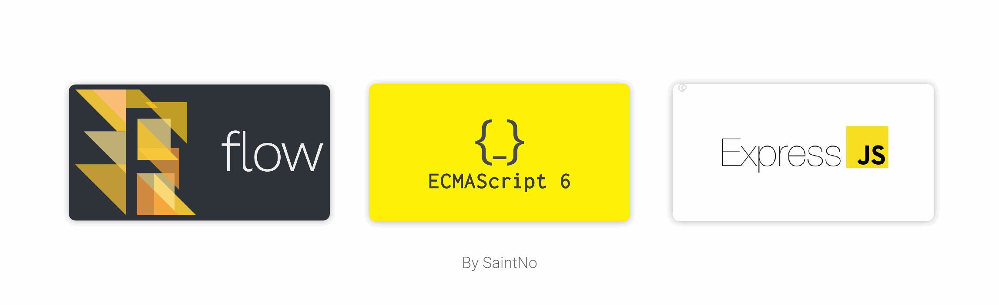

# ExpressFlow JS

ExpressJS server with FlowJS template

    

# About

Include minimal setup for backend starter

- Included expressJS
- Included flowJS to better lint code
- Usable with pm2
- Using concurrently

# Setup

- Require NodeJS
- Clone sources
- Setup package.json as your app's name, about, version and running port
- In `package.json` > `reload-server` script > change `expresstemplate` to your unique app name
- Install `concurrently` by command: `npm install -g concurrently`
- Running `npm run setup` will install requirement and update all dependencies to lastest

# Run command

> Running command by `yarn run <command>`

- `setup`: install requirement for app running
- `update`: update all dependencies to lastest
- `build`: will build `src` to dist for running in produce mode
- `dev`: running app in auto reload mode for developing
- `start`: rebuild your app and start it
- `start-build`: start your app without rebuild build
- `reload-server`: for reload server while running in pm2
- `server`: build and start server with pm2
